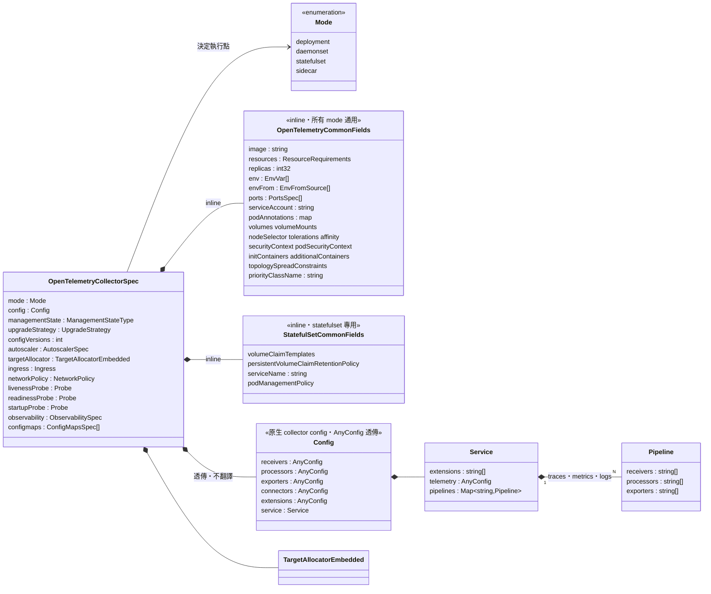
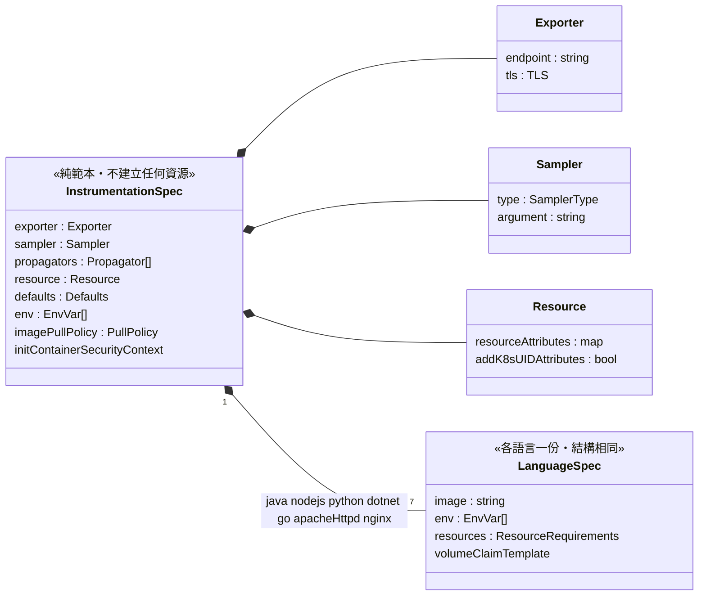
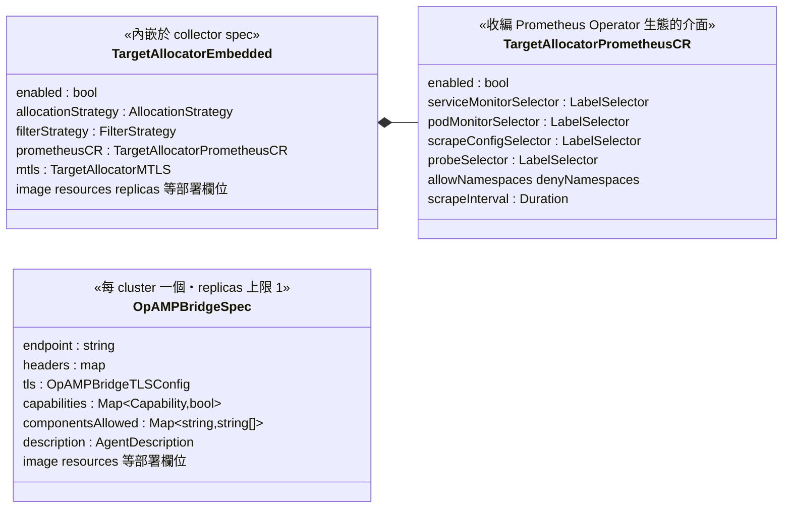

# 分享：用 OpenTelemetry Operator 做兩件事——擴散與治理

> **對象：** 熟悉 Kubernetes Operator Pattern 的資深架構師。不講 CRD/Reconcile/Webhook 是什麼，直接進**設計決策、取捨分析、與我們自己場景的解剖**。
> **形式：** 兩小時（120 分鐘，含中場休息與討論）
> **核心命題：** 只有兩個——
> 1. **擴散**：讓全公司的服務都有 OTel 能力。接入成本壓到「兩三行 annotation」，覆蓋率才可能趨近 100%。
> 2. **治理**：讓所有 OTel Collector 都能中央治理。政策（sampling、遮罩、版本、endpoint）收斂到 CR，由控制迴圈強制。
>
> **跟現況的關係：** 我們的中央 collector（`span-lb`、`collector`，`open-telemetry` namespace）用 Helm chart 交付、跑自建的 contrib image；各 app chart 自己掛 initContainer sidecar 與一長串 `OTEL_*` env。這場分享的每一節都會對照這個現況做分析，而不是講一遍官方文件。
>
> **取材：** 本 repo 的 [classroom 教材](./00-overview.md)、[實戰 lab](./lab/README.md)、對照真實服務的 [llm-guard-api 遷移範例](./lab/manifests/60-example-llm-guard-api-operator.yaml)。所有程式碼引用都可在 repo 驗證。

---

## 時間軸總覽

| 時間 | 段落 | 內容 |
|---|---|---|
| 0:00 – 0:20 | 開場 | 問題框架；三個設計決策；四個 CR 的角色與治理定位 |
| 0:20 – 0:55 | **第一部：擴散** | 注入機制的架構要點、llm-guard-api 遷移解剖、存量矩陣、紅線 |
| 0:55 – 1:00 | 中場休息 | |
| 1:00 – 1:45 | **第二部：治理** | 拓撲分析（現況 vs 目標）、Helm 所有權模型、版本治理、CR 粒度、延伸路 |
| 1:45 – 2:00 | 收尾 | 失效模式矩陣、落地路徑、討論 |

---

## 0. 開場：問題框架、三個設計決策、四個 CR（0:00 – 0:20）

### 0.1 兩層問題 → 兩個主軸（3 min）

- **接不上（擴散問題）**：靠人手動接 SDK，覆蓋率永遠殘缺；agent 版本升級 = 50 個 repo 50 個 PR。
- **管不動（治理問題）**：collector 設定散落在各 app 的 Helm values 裡——我們自己就是：llm-guard-api 的 values.yaml 裡躺著 150 行 OTel 設定（initContainer sidecar、整份 collector config、手工拼的 `OTEL_RESOURCE_ATTRIBUTES`）。想全公司調一次 sampling 或遮罩，等於動所有人的部署。

一句話：**把「靠人遵守的規範」變成「靠控制迴圈強制的狀態」。** 這句大家都懂，今天的重點是它的實作代價與邊界。

### 0.2 這個 Operator 的三個設計決策（9 min）

跳過 operator 101，直接講三個對治理有直接後果、而且不讀 code 不會知道的設計決策：

**決策一：兩個執行點，兩種政策生效語意。**

| | Operator 直接擁有的 workload（gateway/agent） | Webhook 注入的東西（sidecar/instrumentation） |
|---|---|---|
| 執行點 | Reconcile 迴圈，持續 | Mutating webhook，僅 Pod **CREATE**（`verbs=create`，沒有 UPDATE） |
| 改 CR 的生效時機 | **立刻**觸發 rolling update | **惰性**——等各服務下一次 rollout |
| drift 行為 | 手改被改回 | Pod 建立後與 CR 脫鉤，config 是烤進去的（[`pkg/sidecar/pod.go`](../pkg/sidecar/pod.go)） |

治理後果：**下推一個政策，兩類目標的收斂時間完全不同。** 平台需要「多少 % 的 Pod 已拿到新政策」的可見性指標，而不是 apply 完就當生效。

**決策二：`failurePolicy=ignore` —— 注入是 best-effort，可用性優先於政策完整性。**

[`internal/webhook/podmutation/webhookhandler.go:21`](../internal/webhook/podmutation/webhookhandler.go) 的 kubebuilder marker 寫死了這個取捨：operator webhook 不可用時，Pod 照建、只是安靜地沒被注入。設計上合理（observability 元件不該擋業務部署），但它意味著**覆蓋率是要量測的，不是假設的**——需要常態盤點「有 annotation 但沒有 initContainer 的 Pod」。對照組：我們現在的 Helm 做法把 sidecar 烤在 chart 裡，沒有這個 runtime 依賴——這是引入 Operator 真實付出的代價之一，收尾的失效模式矩陣（§3.1）會完整展開。

**決策三：`spec.config` 是透傳設計——collector config 原汁原味，operator 只解析不翻譯。**

CR 的 `spec.config` 就是 collector 設定本體；operator 解析它來推導 Service port、必要的 RBAC，但不改寫語意。這是**遷移成本低的機制根源**：我們現有 chart values 裡的 collector config 可以幾乎原封不動搬進 CR（llm-guard-api 範例實測如此）。同時 `spec.image` 接受任意 image reference——自建的 `ghcr.io/104corp/otel-collector/collector-contrib` 照用，`GOMEMLIMIT` 這類 runtime env 照掛。

一份最小 CR 與它長出來的東西（port 是從 config 的 receiver 推導的，不用自己宣告）：

```yaml
apiVersion: opentelemetry.io/v1beta1
kind: OpenTelemetryCollector
metadata:
  name: gateway
spec:
  mode: statefulset
  replicas: 2
  image: ghcr.io/104corp/otel-collector/collector-contrib:0.142.0  # 自建 image 照用
  config:                        # ← 原汁原味的 collector config，從 Helm values 直接搬
    receivers: { otlp: { protocols: { grpc: {}, http: {} } } }
    exporters: { debug: {} }
    service:
      pipelines:
        traces: { receivers: [otlp], exporters: [debug] }
```

```
$ kubectl get statefulset,svc,cm -l app.kubernetes.io/instance=default.gateway
statefulset.apps/gateway-collector             2/2
service/gateway-collector                      4317/TCP,4318/TCP   ← port 從 config 推導（見下）
service/gateway-collector-headless                                 ← clusterIP: None（見下）
service/gateway-collector-monitoring           8888/TCP            ← collector 自身 metrics
configmap/gateway-collector-<hash>
```

這張輸出有兩個值得停一下的細節：

- **「port 從 config 推導」**：operator 對每個認得的元件註冊了 port mapping（otlp receiver 的 `grpc→4317`、`http→4318`，[`internal/components/receivers/helpers.go:41`](../internal/components/receivers/helpers.go)），建 Service 時掃 config 裡實際接進 pipeline 的 receiver/exporter 把 port 湊出來（[`internal/manifests/collector/service.go:145`](../internal/manifests/collector/service.go)）。語意：**config 裡啟用一個 receiver ＝ Service 自動開對應 port**，刪掉 receiver、port 下一輪 reconcile 就消失。要手動補，`spec.ports` 會跟推導結果合併。
- **headless service**（`clusterIP: None`）：DNS 查它回的是**每個 Pod 的 A record**，不是一個 VIP。任何非 sidecar mode 都會建（[`internal/manifests/collector/collector.go:45-53`](../internal/manifests/collector/collector.go)），但它在 §2.1 的拓撲裡才 load-bearing——loadbalancing exporter 的 dns resolver 靠它枚舉所有 gateway 副本、按 traceID 挑副本直連；查普通 ClusterIP 只會拿到 VIP、被 kube-proxy L4 隨機分配，同一條 trace 的 span 就散掉了。statefulset 的加分是副本身分穩定，擴縮容時雜湊擾動最小。

### 0.3 四個 CR：角色、設計性質、對應我們的資產（8 min）

不逐欄位講（完整欄位見 classroom [第 2 章](./02-crd-api-types.md)、[hackmd.md](./hackmd.md)），每個 CR 講三件事：它治理什麼、它有一個什麼樣的設計性質會影響我們怎麼用它、它對應我們哪塊資產。

| CR | 治理什麼 | 關鍵設計性質 | 對應我們的資產 |
|---|---|---|---|
| `OpenTelemetryCollector`（v1beta1，唯一 stable） | 管線拓撲與資料政策：sampling、遮罩、路由、資源上限 | `spec.mode` 驅動資源組合；`spec.config` 透傳（決策三） | `span-lb`/`collector` 的目的地；各服務的手掛 sidecar |
| `Instrumentation`（v1alpha1） | 接入標準：agent 版本、endpoint、propagator、sampler | **純範本，不建立任何資源**；env 逐項合併 | 取代各 app values 裡那串 `OTEL_*` env |
| `OpAMPBridge`（v1alpha1） | Collector 群的遠端控制面 | 代理「本 cluster 中 operator 管的 collector」給遠端 server，下推**回寫 CR**、滾動更新交回 operator | `l-`/`s-`/`p-` 多環境的控制面選項（§2.5） |
| `TargetAllocator`（v1alpha1，可獨立或內嵌） | Prometheus scrape target 在多副本間的分配 | `prometheusCR.enabled` 直接認得 ServiceMonitor/PodMonitor | 我們現有的 serviceMonitors 資產（§2.5） |

與其逐段貼型別定義，可配置面用三張 UML 看完（只畫治理相關欄位，類別名與 repo 內的 Go struct 一一對應；完整欄位見 [docs/api/](../docs/api/)）。

**UML 一：`OpenTelemetryCollector`——spec 分三層，`config` 是原生 collector 結構的透傳**



讀圖重點：

- **spec 分三層**：CR 專屬欄位（mode、config、autoscaler…）、`OpenTelemetryCommonFields`（inline 進來的 workload 通用欄位——image、resources、env 都在這層，所以自建 image 與 `GOMEMLIMIT` 照掛）、`StatefulSetCommonFields`（只在 statefulset mode 有意義）。
- **`Config` 的每個區段都是 `AnyConfig`（`map[string]any`）**——這就是決策三「透傳不翻譯」在型別層的長相：operator 不為任何 receiver/processor 建型別，schema 由 collector 自己驗。operator 只讀 `service.pipelines` 裡實際接線的元件來推導 Service port 與 RBAC。
- **`mode` 是整份 CR 最 load-bearing 的欄位**：前三種 mode 走 reconcile（即時收斂），`sidecar` 不產生任何獨立 workload——CR 變成範本，等 Pod 帶 annotation 時由 webhook 注入。同一個 Kind 同時活在**兩種執行點**（決策一），政策生效語意取決於 mode，這是設計上最容易被誤解的地方。

**UML 二：`Instrumentation`——平台欄位 + 七份語言區段，全是「要注入的值」而非 workload**



讀圖重點：

- 整份 spec 沒有一個欄位會長出 workload——全部是**待注入的 env 與 initContainer 描述**，這就是「純範本」的型別證據，也是它能放平台 namespace、業務唯讀的原因。
- env 有四層優先序（型別註解明文寫死）：`container 原有 env` > `語言區段 env` > `共用 env` > `exporter/sampler 等欄位推導值`——§1.1 的 append-if-not-set 與所有漸進遷移論證都建立在這條上。
- 語言區段只有七個，**沒有 `php`**（§1.3 的 `inject-sdk` 路線由此而來）；`go` 比別人多一個 `securityContext`（eBPF 需要 privileged）；`java` 多 `extensions`。
- `exporter.endpoint` 是唯一決定「直送 or 走 sidecar」的欄位——§1.4 兩份 CR 的差異就這一格。

**UML 三：`OpAMPBridge` 與 `TargetAllocator`（內嵌形式）——控制面與收編介面**



讀圖重點：`OpAMPBridgeSpec` 的治理欄位就三個——`endpoint`（連哪個控制面）、`capabilities`（授權它做什麼）、`componentsAllowed`（下推白名單，§2.5 的安全閥）；其餘都是部署欄位。`TargetAllocatorPrometheusCR` 的四組 selector 直接吃 Prometheus Operator 的 CR——這就是 §2.5「ServiceMonitor 一個都不用改」的型別依據。

**治理相關欄位的值域速查**（**粗體**為預設值）：

| 欄位 | 值域 | 治理意義 |
|---|---|---|
| `spec.mode` | **deployment** / daemonset / statefulset / sidecar | 決定執行點與生效語意（決策一）；statefulset 是 tail sampling 的前置條件（§2.1） |
| `spec.managementState` | **managed** / unmanaged | 逐 CR 關掉 reconcile 的安全閥（§2.3） |
| `spec.upgradeStrategy` | **automatic** / none | operator 升級時是否自動遷移這份 CR（§2.3） |
| `spec.config.*` | 任意 collector config（透傳） | 決策三；pipeline 接了什麼 receiver ＝ Service 開什麼 port |
| `targetAllocator.allocationStrategy` | **consistent-hashing** / least-weighted / per-node | 唯一能跑 HA（replicas > 1）的是 consistent-hashing |
| `instrumentation.spec.sampler.type` | parentbased_traceidratio 等 | 直接變成 `OTEL_TRACES_SAMPLER` / `_ARG` 下發全公司 |

UML 講結構；結構之外，三個設計性質用講的：

**`Instrumentation` 的「純範本」性質是 RBAC 設計的支點**：它不建立資源，所以可以放平台 namespace、業務團隊唯讀，Pod 用 `"opentelemetry/company-default"` 跨 namespace 引用——標準的單一事實來源與寫入權分離，就是這個性質給的。

**`OpAMPBridge` 的回寫語意**：server 下推的不是 collector config 而是 CR 變更，bridge 改寫 CR、operator 照常 reconcile——控制面疊在 operator 之上而不是繞過它，所以 `componentsAllowed` 白名單、Git diff 這些既有防線仍然有效。

**`TargetAllocator` 是四個裡治理色彩最淡的**，價值在遷移路徑：讓 Prometheus 生態的收編不需要重寫任何 ServiceMonitor。今天只在 §2.5 帶到。

---

## 第一部：擴散——讓全公司的服務都有 OTel 能力（0:20 – 0:55）

### 1.1 注入機制：只講架構師需要的兩個語意（5 min）

機制本身一張圖帶過（決策層讀 annotation → 找 `Instrumentation` CR → 各語言注入器；CR 的角色 §0.3 已講），值得展開的是兩個語意：

```
internal/webhook/podmutation/webhookhandler.go   ← HTTP 層，串接多個 PodMutator
internal/instrumentation/podmutator.go           ← 決策層：annotation → CR 解析
internal/instrumentation/sdk.go                  ← 執行層：injectJava()/injectPython()...
```

1. **`OTEL_SERVICE_NAME` 的推導鏈**：annotation `resource.opentelemetry.io/service.name` > Pod label `app.kubernetes.io/name` > 上層 workload 名稱 > Pod/container 名。意味著大部分服務**連 service.name 都不用設**——llm-guard-api 的 Deployment 名就是 `llm-guard-api`，推導結果與原本手動設的值相同。
2. **env 合併是 append-if-not-set**（`internal/instrumentation/python.go:57` 等）：container 自己的 env 永遠優先，CR 只補沒設過的。這是後面所有「漸進遷移」與「per-service 例外」論證的基礎——先記住這條。

輸入與輸出各一張投影片。業務團隊寫的全部東西：

```yaml
spec:
  template:
    metadata:
      annotations:
        sidecar.opentelemetry.io/inject: "opentelemetry/company-sidecar"
        instrumentation.opentelemetry.io/inject-python: "opentelemetry/company-sidecar"
```

Pod 建立後 webhook 產出的結果（`kubectl describe pod` 節錄）：

```
Init Containers:
  opentelemetry-auto-instrumentation-python   ← agent 複製進共用 volume
  otc-container                               ← sidecar collector（k8s ≥1.29 為 native sidecar）
Containers:
  llm-guard-api:
    Environment:
      PYTHONPATH:        /otel-auto-instrumentation-python/...
      OTEL_SERVICE_NAME: llm-guard-api        ← 自 Deployment 名推導，沒人手寫
      OTEL_RESOURCE_ATTRIBUTES: k8s.namespace.name=...,k8s.deployment.name=...
```

### 1.2 場景解剖：llm-guard-api 的 150 行去哪了（12 min，本部主菜）

對照 [`60-example-llm-guard-api-operator.yaml`](./lab/manifests/60-example-llm-guard-api-operator.yaml) 與 [`60-example-llm-guard-api-values-after.yaml`](./lab/manifests/60-example-llm-guard-api-values-after.yaml)。結果先講：values.yaml 從 150 行 OTel 設定變成 **3 行 podAnnotations + 1 行刻意留下的例外**。但重點不是行數，是**每一類設定的去向都對應一條治理原則**：

| 原本的東西 | 去向 | 為什麼——這才是要講的 |
|---|---|---|
| `initContainers` 手掛的 collector sidecar + `corp104Configs` 整份 config | sidecar 模式的 `OpenTelemetryCollector` CR，config 原封不動 | 決策三的透傳設計。附帶對齊：operator 在 k8s ≥ 1.29 **自動以 native sidecar 注入**（initContainer + `restartPolicy: Always`，[`internal/autodetect/main.go:271`](../internal/autodetect/main.go)）——跟我們手掛的形式一致，啟動/終止順序語意不變 |
| `OTEL_PYTHON_EXCLUDED_URLS`（健檢路徑） | **留在 app 自己的 env，不進 CR** | per-service 差異不該進共用範本；靠 append-if-not-set，container 自己的值天生贏。**不用為此 clone CR** |
| `OTEL_SERVICE_NAME` | 刪掉，自動推導 | §1.1 推導鏈 |
| `OTEL_EXPORTER_OTLP_PROTOCOL: http/protobuf` | 刪掉 | operator 的 Python 預設剛好相同——但這是「預設剛好一致」不是「不需要」，官方預設若改要加回來 |
| 手工拼的 `OTEL_RESOURCE_ATTRIBUTES`（k8s.namespace/pod/node…）+ 一整組 Downward API env | 刪掉，由 operator 注入的 sidecar 自動蓋章 | **這條是架構性的**，§2.1 展開：手工拼這串的存在，本身就是現有拓撲缺陷的症狀 |
| `OTEL_ZERO_CODE_MODE`（base image 的包裝旗標） | 必須拿掉 | 跟 `inject-python` 是兩套互斥的 auto-instrument 機制，同時開 = 雙重插樁 |

「after」的 values.yaml 全貌，就這幾行（[完整檔案](./lab/manifests/60-example-llm-guard-api-values-after.yaml)）：

```yaml
web:
  podAnnotations:
    sidecar.opentelemetry.io/inject: "llm-guard-api-sidecar"
    instrumentation.opentelemetry.io/inject-python: "llm-guard-api-instrumentation"
    instrumentation.opentelemetry.io/container-names: "llm-guard-api"
  env:
    - name: OTEL_PYTHON_EXCLUDED_URLS      # 唯一刻意留下的例外：per-service 健檢路徑，
      value: "/healthz,/readyz,/metrics"   # 靠 append-if-not-set 天生贏過 CR
```

給架構師的提煉：**「翻譯」過程不做架構升級**（原本沒有 logs pipeline 就不加），一次只變一個變數；但翻譯過程會**暴露既有架構的症狀**（手工拼 k8s 屬性那條），記下來、下一部處理。

### 1.3 存量矩陣：全公司服務怎麼收斂成一套模型（6 min）

存量不會整齊。統一模型：**sidecar annotation 人人加，差別只在 Instrumentation 端用哪種 inject annotation**：

| 服務類型 | Instrumentation annotation | 團隊要做的事 |
|---|---|---|
| 無 OTel（Java/Python/Node） | `inject-<lang>` | 加兩行 annotation |
| 已手動裝 javaagent（Dockerfile 塞的） | 改用 `inject-<lang>` | 從 image 移除 agent |
| 已手動裝 SDK（程式內建 provider） | `inject-sdk`（只注入 env、不裝 agent） | 移除硬編的 provider 配置，改 env 驅動 |
| PHP | `inject-sdk` | image 裝 PECL extension，設 `OTEL_PHP_AUTOLOAD_ENABLED` |

邊界條件（會被問，先備好）：

- **PHP 沒有自動注入**（`InstrumentationSpec` 無 php 欄位）。`inject-sdk` 是正解：agent 安裝留在 image，但 endpoint/sampler/resource/propagator 仍由平台 CR 集中下發——治理面不缺角，只缺零改 code。
- **Go 是 eBPF sidecar**，要 privileged + `otel-go-auto-target-exe`，feature gate 預設關。安全審查成本高，Go 服務建議直接走 `inject-sdk` + 手動 SDK。
- 排查「沒被注入」：feature gate 沒開時 webhook 發 `InstrumentationRequestRejected` Warning event，Pod 照建——又一個「安靜失敗」點，跟決策二同一族。

### 1.4 組合技與 endpoint 陷阱（4 min）

`inject-sdk` + `sidecar.opentelemetry.io/inject` 疊在同一個 Pod，由同一個 pod mutation webhook 分別處理。一個必講的陷阱：

**走 sidecar 的服務，`Instrumentation` CR 的 `exporter.endpoint` 必須留空。** `configureExporter`（[`internal/instrumentation/exporter.go`](../internal/instrumentation/exporter.go)）只在 CR endpoint 非空時注入 `OTEL_EXPORTER_OTLP_ENDPOINT`；留空 → SDK 落回預設 `localhost:4318` → 正好打到同 Pod 的 sidecar。endpoint 指向 gateway 的話 SDK 會繞過 sidecar 直送。**結論：需要兩份 Instrumentation CR**（`company-default` 給直送的、`company-sidecar` 給掛 sidecar 的），這是 CR 切分的第一個實例——差異只有一個欄位：

```yaml
kind: Instrumentation
metadata: { name: company-default, namespace: opentelemetry }
spec:
  exporter:
    endpoint: http://gateway-collector.open-telemetry.svc:4318   # SDK 直送 gateway
  sampler: { type: parentbased_traceidratio, argument: "0.25" }
  python: { ... }   # 各語言 section 兩份 CR 相同
---
kind: Instrumentation
metadata: { name: company-sidecar, namespace: opentelemetry }
spec:
  exporter: {}      # ← 留空：不注入 endpoint → SDK 預設 localhost:4318 → 同 Pod sidecar
  sampler: { type: parentbased_traceidratio, argument: "0.25" }
  python: { ... }
```

### 1.5 紅線與漸進語意（5 min）

1. **已手動插樁的服務絕不加 `inject-<lang>`**：operator 的防重複檢查（`isAutoInstrumentationInjected`）只認自己注入的東西，不知道 image 裡的手動 agent。Java 的後果最具體——operator 往既有 `JAVA_TOOL_OPTIONS` 後面 append，兩個 agent 同時掛。
2. **「移除手動配置」= 移除 provider 初始化，不是移除 SDK。** 業務 code 裡的 OTel API 呼叫（自訂 span/metric）全留；provider 改成無參數、由 env 自動配置。**API/SDK 分界正是 OTel 留給平台治理的縫**：團隊寫 API 表達「記什麼」，平台透過 CR 決定「送哪、怎麼採、掛什麼標」。
3. **漸進的機制保證**：append-if-not-set 意味著團隊自己的 `OTEL_*` env 不會被蓋。還沒改完 provider 的服務先掛 sidecar annotation（先拿到 k8s 屬性蓋章），改完再補 `inject-sdk`——每一步都可以獨立 rollback。

### 第一部討論題（3 min）

- 我們的 base image 還有哪些像 `OTEL_ZERO_CODE_MODE` 這種自帶的 OTel 邏輯？盤點清單誰負責？
- 覆蓋率指標怎麼做？（「有 inject annotation 但沒有對應 initContainer」的偵測放哪裡跑：定期 CronJob？Kyverno/OPA audit？）

---

## 中場休息（0:55 – 1:00）

---

## 第二部：治理——讓所有 Collector 都能中央治理（1:00 – 1:45）

### 2.1 拓撲分析：現況的結構性問題，與目標拓撲（10 min）

**現況資料流**（從 llm-guard-api 的 config 反推）：

```
app SDK → 手掛 sidecar → span-lb.open-telemetry.svc（跨 namespace 中央 collector）→ Tempo
                        → collector.open-telemetry.svc → metrics 後端
```

兩個結構性問題，都不是「設定沒調好」，是拓撲本身的：

1. **k8s 屬性只能手工拼。** `k8sattributes` processor 靠連線來源 pod IP 反查 metadata；資料一經任何中繼轉手，來源 IP 就不是原始 Pod。我們的 sidecar 直送跨 namespace 的中央 collector，中央層看到的 IP 是 sidecar 所在 Pod 的——勉強可用，但只要中間再加一層 LB 就失真。所以每個服務的 values 裡都手工拼了一份 `OTEL_RESOURCE_ATTRIBUTES` + Downward API env——**同一段邏輯複製 N 份，這就是「治理缺位」的具體長相**。operator 的解法：注入 sidecar 時自動備好組好的 `OTEL_RESOURCE_ATTRIBUTES`（含 owner reference 反查的 deployment/replicaset 名稱，[`pkg/sidecar/attributes.go`](../pkg/sidecar/attributes.go)），sidecar config 一個 `resourcedetection`（env detector）收工——不打 k8s API、不用 RBAC、沒有 k8sattributes 的 cache 開銷。
2. **tail sampling 沒有正確的前置條件。** 多副本 gateway 做 tail sampling，同一 trace 的所有 span 必須進同一副本。目前 `span-lb` 這個名字暗示有做 span 層級 LB——遷移時要驗證它的 routing key 是不是 traceID；如果只是 Service 層的 L4 均衡，tail sampling 的決策一直在看片段。

**目標拓撲**（lab [Stage 2](./lab/02-collector-gateway-and-loadbalancer.md) 的標準解）：

```
sidecar（k8s 屬性蓋章）→ agent DaemonSet（memory_limiter、loadbalancing exporter,
                          routing_key: traceID）→ gateway StatefulSet × N（tail_sampling）→ 後端
```

整個拓撲的核心就這兩段 config（完整版：lab [10-collector-gateway.yaml](./lab/manifests/10-collector-gateway.yaml)、[11-collector-agent-lb.yaml](./lab/manifests/11-collector-agent-lb.yaml)）：

```yaml
# agent CR（mode: daemonset）—— span load balancer 的核心
exporters:
  load_balancing:              # contrib ≥ 0.153.0 的新名；舊名 loadbalancing 已為 deprecated alias
    routing_key: traceID       # 同一條 trace 的所有 span 永遠送同一個 gateway 副本
    resolver:
      dns:
        hostname: gateway-collector-headless.open-telemetry.svc.cluster.local
        port: "4317"
```

```yaml
# gateway CR（mode: statefulset）—— sampling 政策唯一的家
processors:
  tail_sampling:
    decision_wait: 10s
    policies:                  # policy 之間是 OR
      - { name: errors, type: status_code, status_code: { status_codes: [ERROR] } }
      - { name: slow,   type: latency,     latency: { threshold_ms: 500 } }
      - { name: rest,   type: probabilistic, probabilistic: { sampling_percentage: 10 } }
```

- gateway 用 `statefulset` mode 不是偏好，是 loadbalancing resolver 需要 headless service 的穩定 DNS——`spec.mode` 一個欄位，operator 長出正確資源組合。
- sampling 政策只存在 gateway CR 一個地方；後端地址只在 gateway 設一次，sidecar/agent 都不知道後端是誰——換後端不動任何業務部署。
- **sidecar 的成本要誠實**：per-pod 線性增長。買到 per-pod 身分蓋章、per-service 客製隔離、短生命週期 process 的就近 flush（PHP-FPM 這類）。三個都用不上的服務，讓 SDK 直送 agent 層即可，模型允許混用。

### 2.2 Helm × Operator：所有權模型與搬家路徑（12 min，本部重點）

**心法：Helm 管交付，Operator 管執行期。** `helm upgrade` 結束的那一刻 Helm 的工作完成，operator 的工作才開始。引入 operator 改變的不是「用不用 Helm」，是 **Helm 交付物從 workload 變成 CR**。所有權邊界一張表：

| 資源 | 擁有者 | 誰都不准 |
|---|---|---|
| Operator 本身（Deployment、webhook、cert） | Helm（官方 chart，`autoGenerateCert` 免 cert-manager，lab [Stage 0](./lab/00-setup.md) 實測） | |
| CRD | Helm，**但注意升級語意（下述坑 1）** | |
| 平台的 CR（gateway/agent/Instrumentation） | 平台的 chart 或 GitOps repo——**政策交付照走 Git PR + CD，流程不變** | |
| Operator 長出來的 Deployment/ConfigMap/Service | Operator | Helm 和人。改了會被 reconcile 改回（feature，不是 bug） |
| app chart | 業務團隊，只動 values 的 podAnnotations | |

想一步到位的話，官方 `opentelemetry-kube-stack` chart 把「operator + CR 形式的 collectors + Instrumentation」打包成一個 chart，適合新 cluster 起手式；存量 cluster 用分層遷移：

| 階段 | 動作 | 風險控制 |
|---|---|---|
| 1 | **中央層不動**。operator 只管 sidecar + Instrumentation，sidecar exporter 照指 `span-lb.open-telemetry.svc`（llm-guard 範例現在就這樣寫） | 中央層零變更 |
| 2 | 中央 collector 的 config 從 chart values 搬進 CR。config 透傳、`spec.image` 用自建 image、env 照掛 | **Service 名稱會變**：operator 產生 `<CR名>-collector`（CR 叫 `span-lb` → service 是 `span-lb-collector`）。切換期留一個舊名 ExternalName/手動 Service 當 alias，或反過來把切流量做在 sidecar CR 的 exporter endpoint（改一份 CR = 全量切，配合 per-service 的 CR 可以灰度） |
| 3 | 新舊並行驗證後下掉 Helm 版 collector | 隨時可切回：endpoint 改回去就好 |

階段 2 那個「舊名 alias」具體長這樣（下游全部切完、驗證無流量後即可刪）：

```yaml
# 讓還指著 span-lb.open-telemetry.svc 的下游不用同步改
apiVersion: v1
kind: Service
metadata: { name: span-lb, namespace: open-telemetry }
spec:
  type: ExternalName
  externalName: span-lb-collector.open-telemetry.svc.cluster.local  # operator 產生的新名
```

**三個坑（都是營運層面的，架構評審要過）：**

1. **Helm 對 `crds/` 目錄只裝不升。** `helm upgrade` operator 不會動 CRD；新版 operator 對舊 CRD schema 會出現欄位靜默丟失。CRD 升級要進 operator 的升級 runbook（chart 選項或獨立的 `kubectl apply`），而且 CRD 是 cluster-scoped——多團隊共用 cluster 時它是隱形的全域依賴。
2. **GitOps 健康判斷。** CR apply 成功 ≠ collector 起來了。ArgoCD/Flux 需要補 custom health check 看 CR 的 `status`，否則 sync green 但 pipeline 是壞的。
3. **雙主人。** 上表最後兩行的紀律要寫進團隊規範：發現 operator 管的資源「一直被改回去」，正確反應是去改 CR，不是加大力度改 Deployment。

### 2.3 版本治理：versions.txt vs 我們的自建 image（7 min）

Operator 的版本治理模型：[`versions.txt`](../versions.txt) 把 collector、各語言 agent、target allocator 的版本釘成一組——**發佈一個 operator 版本 = 發佈一整組驗證過的元件版本**。operator 升級時，upgrade routine（[`pkg/collector/upgrade/upgrade.go`](../pkg/collector/upgrade/upgrade.go)）主動把 cluster 裡所有 CR 遷到新 schema/預設值；`spec.upgradeStrategy: none` 和 `spec.managementState: unmanaged` 是逐 CR 的安全閥。

**但我們有一個跟這個模型直接衝突的現實：collector 跑自建 image（`ghcr.io/104corp/...` pin 0.142.0）。** 分析清楚這個取捨：

- `spec.image` 明確指定時，operator 的自動版本升級**不會**動它——我們保留了自建 pipeline 的控制權，但也**放棄了「升 operator = 升全部 collector」的治理紅利**。collector 版本的治理責任仍在我們自己的 image pipeline。
- 各語言 instrumentation agent 的 image 是另一回事：`Instrumentation` CR 不 pin 的話跟著 operator 預設走。**建議 agent 交給 operator 治理（不 pin），collector 維持自建**——兩者的客製需求不同（collector 有公司內部 exporter/processor 的需求，agent 沒有）。
- 遺留問題排進 roadmap：自建 image 的升級節奏要跟 operator 版本對表（operator 解析 config 推導 port/RBAC，跨大版本的 config schema 變更兩邊要同步驗）。

### 2.4 資料治理與 CR 粒度：merge vs replace、共用的邊界（10 min）

**CR 的邊界 = 爆炸半徑的邊界**，這句話要落到可操作的判準。兩種 CR 的客製化語意天差地遠，決定了「什麼時候該拆 CR」：

| | sidecar collector CR | Instrumentation CR |
|---|---|---|
| 客製化語意 | config **整份取代**，無欄位優先權 | env **逐項合併**（append-if-not-set） |
| 「這個服務想不一樣」 | 只能 clone 一份 CR（lab [Stage 7](./lab/07-team-scoped-attributes.md) 的 `order-sidecar` 模式） | 多數情況**不用 clone**——值留在 app 自己的 env 就贏了（llm-guard 的 `EXCLUDED_URLS`） |
| 拆分判準 | 需求會分岔的團隊，現在就拆 | 只有「endpoint/sampler 這種 CR 層欄位」要不一樣時才拆（§1.4 的兩份 CR 就是例子） |

**先回答一個必被問的問題：sidecar CR 可以共用嗎？metadata 跟 namespace 不會出事嗎？**

可以，機制上兩個疑慮都不成立：

- **跨 namespace 引用支援**：annotation 值寫 `"opentelemetry/company-sidecar"` 即可（[`pkg/sidecar/podmutator.go:96-103`](../pkg/sidecar/podmutator.go)，`strings.Cut(ann, "/")`）；只有 `"true"` 才限定 Pod 自己的 namespace。
- **config 整份 inline 進 `OTEL_CONFIG` env**（`--config=env:OTEL_CONFIG`，[`pkg/sidecar/pod.go:27-35`](../pkg/sidecar/pod.go)），不落地任何 ConfigMap——CR 放平台 namespace 不產生跨 namespace 資源依賴。
- **per-pod metadata 是注入當下逐 Pod 計算的，不是從 CR 來的**：`k8s.namespace.name` 取 **Pod 的** namespace、pod/node 走 downward API、deployment/replicaset 從該 Pod 的 owner reference 反查（[`pkg/sidecar/attributes.go:29-47`](../pkg/sidecar/attributes.go)）。一份共用 CR，N 個 Pod 各自拿到正確身分。

共用的真正約束是這三條，寫進共用範本的設計規範：

1. **config 必須 namespace 中立**——exporter endpoint 用 FQDN（llm-guard 範例的 `span-lb.open-telemetry.svc.cluster.local` 就是），相對 service 名會在 Pod 的 namespace 解析。
2. **避開 `spec.configMaps`/`spec.volumes`/secretKeyRef**——這些以 `LocalObjectReference` 在 **Pod 的 namespace** 解析，共用 CR 引用它們等於要求每個消費 namespace 自備同名資源。
3. **config 無合併語意**——per-service 差異只能 clone（下表）。

治理面的附註：webhook 用 operator 的權限讀 CR，**沒有「誰有資格引用哪份 CR」的授權檢查**——per-team CR 防不了被別的團隊誤指，防線是 annotation 的 code review。

**Worked example（現場逐行驗證）：** 把 [llm-guard-api 的 sidecar CR](./lab/manifests/60-example-llm-guard-api-operator.yaml) 拿三條約束驗一遍——endpoint 全是 FQDN ✓、沒有 configMaps/volumes ✓、config 裡沒有一行是 llm-guard-api 專屬的（otlp/batch/memory_limiter/health_check 全是通用件）✓。結論：**這份 per-service CR 其實是共用範本的候選**，改個 name/namespace 就能升格成 `opentelemetry/company-sidecar`。唯一剩下的 per-service 分岔維度是 sizing（`resources`、`GOMEMLIMIT` 在 spec 上、整份取代）——解法是平台提供幾檔尺寸的範本（S/M/L），而不是每服務 clone 一份。這個例子把判準講活了：**拆 CR 的理由必須是「config 內容分岔」，而不是「每個服務習慣性自帶一份」——後者正是我們現在 Helm values 時代的慣性。**

資料政策放 pipeline，不放信任裡——遮罩做在 collector processor，資料出 cluster 前已處理。選型法則：固定 key/value 用 `attributes`；條件、regex、跨欄位才上 `transform`（OTTL）；合規更嚴用 `delete_key`。搭配 RBAC：平台擁有 gateway/agent/Instrumentation CR，業務團隊只有自己 namespace 的 annotation 權（進階：自己的 sidecar CR）。

兩種 processor 各一段（出自 lab [Stage 7 的 order-sidecar CR](./lab/manifests/50-order-sidecar-attributes.yaml)）：

```yaml
processors:
  attributes/order_team:           # 固定標籤：attributes processor 就夠
    actions:
      - { key: team,        value: "order-team", action: insert }  # insert = 不覆蓋既有值
      - { key: cost_center, value: "CC-4821",    action: insert }
  transform/order_team:            # 條件 + regex 遮罩：才需要 OTTL
    trace_statements:
      - context: span
        statements:
          - replace_pattern(attributes["db.statement"],
              "(?i)VALUES\\s*\\([^)]*\\)", "VALUES (***redacted***)")
            where attributes["db.statement"] != nil
```

一條實測教訓帶過（§3.1 還會回收）：Hibernate 產小寫 `values`，沒加上面那個 `(?i)` 的遮罩規則**靜默不匹配**——語法全對、collector 不報錯、資料照漏。OTTL 政策上線前要拿真實流量驗證命中率。

### 2.5 兩條延伸路：TargetAllocator 與 OpAMP（6 min）

**TargetAllocator——我們的 ServiceMonitor 資產有現成的收編路。** 現況 metrics 走 Prometheus Operator 生態（llm-guard 的 values 裡就有 serviceMonitors/prometheusRules）。若未來 metrics 也要進 OTel 管線，TA 的 `prometheusCR.enabled` 直接認得現有 ServiceMonitor/PodMonitor——**各團隊已寫好的 monitor 一個都不用改**，TA 負責把 scrape target 用一致性雜湊分配到多個 collector 副本。不是今天的行動項，但它決定了「metrics 遷移」不需要另起爐灶。

**OpAMP——多環境的控制面選項。** 我們的 namespace 命名（`l-`/`s-`/`p-`）顯示至少三套環境。`OpAMPBridge` 在每個 cluster 跑一個 bridge，把「該 cluster 裡 operator 管的所有 collector」代理給遠端控制面：回報 effective config、接受下推（回寫 CR，滾動更新交回 operator）、`componentsAllowed` 當白名單安全閥。lab [Stage 6](./lab/06-opamp-remote-version-upgrade.md) 實測過不碰 kubectl 遠端改 `spec.image` 完成升級。架構定位要講清楚：**它跟 GitOps 是競合關係**——同一份 CR 不能同時被 ArgoCD 和 OpAMP server 當 source of truth，選了 OpAMP 下推的欄位就要從 Git 管理範圍拿掉，否則兩個控制面互相打架。多環境如果 GitOps 已經順，OpAMP 的增量價值在「秒級動態調參」（臨時調 sampling 率救火）而不是常規變更。

---

## 收尾（1:45 – 2:00）

### 3.1 失效模式矩陣：引入 Operator 後，什麼變脆了（6 min）

對架構師最誠實的一節。現況（Helm 烤死在 chart 裡）沒有 runtime 依賴；operator 把自己放進了兩條路徑。逐格分析：

| 情境 | 已在跑的 Pod | 新建/重啟的 Pod | 中央 gateway/agent |
|---|---|---|---|
| operator Pod 掛掉 | 不受影響（注入物已烤進 Pod） | **建得起來，但安靜地沒被注入**（`failurePolicy=ignore`） | 不受影響（是普通 workload），但 CR 變更不再收斂 |
| webhook cert 失效 | 不受影響 | 同上，安靜失敗 | 不受影響 |
| CRD 被誤刪 | 不受影響 | 注入失效 | **級聯刪除所有 CR 與衍生資源**——CRD 要有 RBAC 保護與備份 |
| CR 被誤改 | 注入類：不受影響直到 rollout | 拿到錯的政策 | 立刻 rolling update 到錯的狀態——CR 的 Git review 就是最後防線 |

配套（寫進 runbook 的具體項）：operator 本身的 HA 與監控、覆蓋率盤點（§第一部討論題）、CRD 納入備份、OTTL 規則上線前的真實流量驗證、「政策收斂率」指標（多少 % Pod 已拿到新版注入）。

### 3.2 落地路徑：對應我們的現況（4 min）

| 階段 | 動作 | 對業務團隊的成本 |
|---|---|---|
| 1 | Helm 裝 operator；中央 collector 不動（§2.2 階段 1） | 零 |
| 2 | 平台建兩份 `Instrumentation` CR（直送版/sidecar 版）+ 標準 sidecar CR；新服務與無 OTel 服務接入 | 兩三行 annotation |
| 3 | 手動裝過 OTel 的服務逐一遷移（llm-guard-api 模式：留 API、去 provider；拆 base image 旗標） | 一次性遷移，每步可回退 |
| 4 | 中央 collector 搬進 CR，agent+gateway 拓撲補上 traceID routing，灰度切換（§2.2 階段 2-3） | 零 |
| 5 | 視需求：TA 收編 metrics、OpAMP 上多環境控制面、業務客製走專屬 sidecar CR | 各團隊自理 |

**遷移論證的核心：** 遷移前，observability 設定散落在 app 的 Helm values，改政策 = 改 app 部署；遷移後收斂到 CR，**app 部署與 observability 政策解耦**——同時每個服務刪掉一份手工複製的 k8s 屬性拼裝邏輯。

### 3.3 帶走的三句話 + 討論（10 min）

1. **擴散靠把介面壓窄**：平台擁有政策（CR），業務團隊只表達意圖（annotation）；env 合併語意讓例外留在 app 端，不腐蝕共用範本。
2. **治理靠迴圈，不靠自律**：Helm 管交付、operator 管執行期；但兩種執行點的政策生效語意不同，收斂要量測。
3. **知道機制的邊界**：注入 best-effort、惰性生效、CRD 生命週期、自建 image 讓出的治理紅利——這些寫進 runbook 與架構決策記錄，而不是被它們 surprise。

討論題備選：

- 中央 collector 搬 CR 的階段 2，切流量放 sidecar CR 的 endpoint 還是留 alias Service？（前者可灰度、後者不動業務 CR）
- collector 自建 image 的升級節奏，要不要跟 operator 版本對表、由誰 own？
- OpAMP 與現有 GitOps 的邊界怎麼劃——哪些欄位允許控制面動態下推？

---

## 附錄 A：每段內容的材料對照

| 分享段落 | 素材來源 | Demo |
|---|---|---|
| 0.2 三個設計決策 | `webhookhandler.go` marker、`pkg/sidecar/pod.go`、classroom 第 4/5 章 | — |
| 0.3 四個 CR | UML 依 `apis/v1beta1/`、`apis/v1alpha1/` 型別定義繪製；完整欄位見 [docs/api/](../docs/api/)、classroom [第 2 章](./02-crd-api-types.md)、[hackmd.md](./hackmd.md) | — |
| 1.1 注入語意 | classroom [第 6 章](./06-auto-instrumentation.md)（推導鏈、env 優先級） | lab [Stage 8](./lab/08-observability-backends.md) §8.5 的 before/after 重播（Grafana 上看 signal 隨 annotation 出現/消失，約 3 分鐘） |
| 1.2 llm-guard-api 解剖 | [60-example 兩份檔案](./lab/manifests/60-example-llm-guard-api-operator.yaml)（含逐條註解） | before/after 對照投影片 |
| 1.3–1.5 存量矩陣/組合技/紅線 | [hackmd.md](./hackmd.md)「落地：接入矩陣」「組合技」節、lab Stage 4 | — |
| 2.1 拓撲分析 | lab [Stage 2](./lab/02-collector-gateway-and-loadbalancer.md)、`pkg/sidecar/attributes.go` | lab Stage 2 |
| 2.2 Helm 所有權模型 | lab [Stage 0](./lab/00-setup.md)、llm-guard-api 範例 | — |
| 2.3 版本治理 | classroom [第 11 章](./11-upgrade-and-change.md)、`pkg/collector/upgrade/` | — |
| 2.4 CR 粒度 | lab [Stage 7](./lab/07-team-scoped-attributes.md)、llm-guard env 合併註解 | lab Stage 7（選放） |
| 2.5 TA / OpAMP | lab [Stage 5](./lab/05-opamp-bridge-control-plane.md)/[6](./lab/06-opamp-remote-version-upgrade.md) | lab Stage 6（選放） |
| 3.1 失效模式 | lab 各 stage 實測 + `failurePolicy` 分析 | — |

## 附錄 B：想深入時往哪走

| 你想深入的問題 | 去讀 |
|---|---|
| Reconcile / mutate 策略 / 樂觀鎖 | classroom [第 1](./01-operator-pattern.md)、[5 章](./05-reconcile-loop.md) |
| 四個 CR 的完整欄位與範例 | classroom [第 2 章](./02-crd-api-types.md)、[hackmd.md](./hackmd.md) |
| Webhook 注入三層架構 | classroom [第 4 章](./04-webhook-injection.md) |
| 各語言注入差異、env 優先級、service.name 推導 | classroom [第 6 章](./06-auto-instrumentation.md) |
| CR/Operator/CRD 三種升級機制 | classroom [第 11 章](./11-upgrade-and-change.md) |
| 從零跑一遍（90-150 分鐘） | [lab/README.md](./lab/README.md) Stage 0-7 |
| tail sampling + span LB 實作 | lab [Stage 2](./lab/02-collector-gateway-and-loadbalancer.md) |
| 業務客製與隔離實驗 | lab [Stage 7](./lab/07-team-scoped-attributes.md) |
| 真實服務 before/after | [60-example-llm-guard-api-operator.yaml](./lab/manifests/60-example-llm-guard-api-operator.yaml)、[values-after](./lab/manifests/60-example-llm-guard-api-values-after.yaml) |
